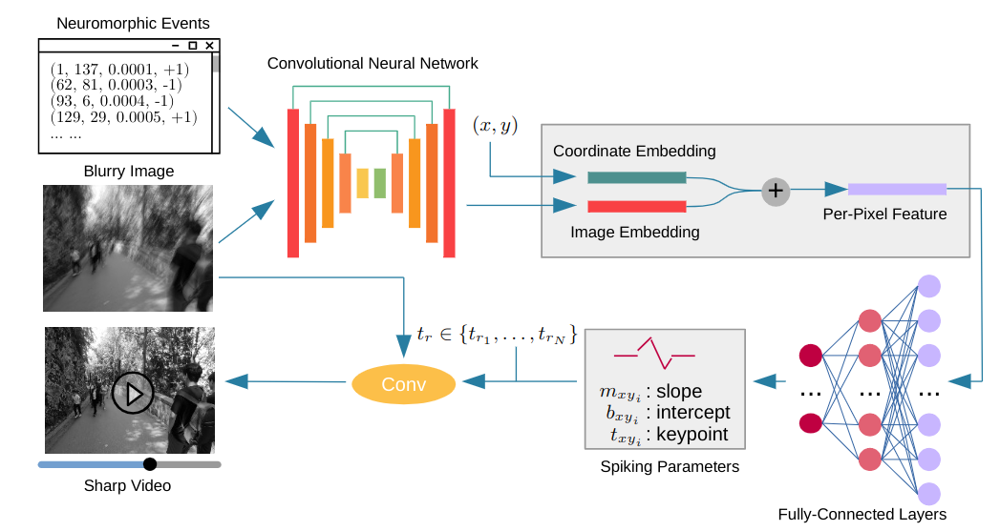
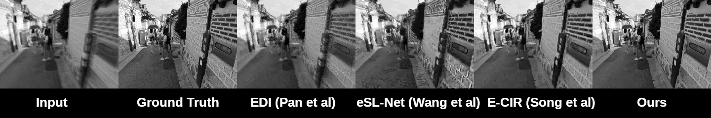

# DeblurSR: Event-Based Motion Deblurring Under the Spiking Representation
This repository contains authors' implementation of [DeblurSR: Event-Based Motion Deblurring Under the Spiking Representation](https://arxiv.org). Our implementation uses the [PyTorch](https://pytorch.org/) library. We warmly welcome any discussions related to our implementation and our paper. Please feel free to open an issue.

## Introduction
Given a blurry image and its associated events in the exposure interval, we apply a Convolutional Neural Network (CNN) to extract an image embedding with the same spatial resolution as the input. For each pixel (x, y), we fuse the image embedding with the coordinate embedding using the addition operation. A group of fully-connected layers take the resulting per-pixel feature vector as input and regress the spiking parameters for each pixel as output. At time t_r, we assemble a spatially varying kernel from the predicted spiking parameters. The convolution of this kernel with the input blurry image gives the output sharp frame at time t_r. By changing the timestamps, the spiking representation allows DeblurSR to render a sharp video with an arbitrarily high frame-rate.



## Environment set-up
Please install [Anaconda](https://www.anaconda.com/distribution/) first and execute the following commands:
```
conda create -y --name deblursr python==3.8.11
conda install -y -q --name deblursr -c pytorch -c conda-forge --file requirements.txt
conda activate deblursr
```

## Dataset set-up
We experimented DeblurSR on the [REDS](https://seungjunnah.github.io/Datasets/reds.html) dataset and the [HDF](https://timostoff.github.io/20ecnn) dataset. Please refer to [REDS\_Dataset.md](REDS_Dataset.md) and [HQF\_Dataset.md](HQF_Dataset.md) for instructions on how to set up these two datasets.

## Training
On the REDS dataset, please set the arguments in `src/main_reds.py` and run:
```
python src/main_reds.py
```

On the REDS dataset, please set the arguments in `src/main_reds.py` and run:
```
python src/main_reds.py
```

## Pre-trained weights
You can download our pre-trained weights here: [OneDrive](https://utexas-my.sharepoint.com/:u:/g/personal/song_austin_utexas_edu/EUbmgKTIkfhAnzoVRcYBYOEBCMUhXTZmx5d_jx25QVLdwg?e=FoK3aR).

After downloading the weights, move them accordingly so that the directory structure looks like this:
```
<project root>
  |-- data
  |     |-- <data files>
  |-- lib
  |     |-- <source files>
  |-- src
  |     |-- <source files>
  |-- trainers
  |     |-- <source files>
  |-- saved_weights
  |     |-- hqf
  |     |     |-- checkpoints
  |     |     |     |-- 49
  |     |     |     |    | model_pred.pth
  |     |     |     |    | optimizer_pred.pth
  |     |     |-- log
  |     |     |     |-- events.out.tfevents.1660695464.dgx-1.12797.0
  |     |-- reds
  |     |     |-- checkpoints
  |     |     |     |-- 49
  |     |     |     |    | model_pred.pth
  |     |     |     |    | optimizer_pred.pth
  |     |     |-- log
  |     |     |     |-- events.out.tfevents.1659907694.dgx-5.67437.0
```

## Evaluation
To evaluate the MSE, PSNR, and SSIM on the REDS dataset, please run:
```
python src/main_reds.py --load_dir saved_weights/reds/checkpoints/49 --save_dir saved_weights/reds
```

This saves the output images to `saved_weights/reds/output` and prints quantitative results to stdout.

To evaluate the MSE, PSNR, and SSIM on the HQF dataset, please run:
```
python src/main_hqf.py --load_dir saved_weights/hqf/checkpoints/49 --save_dir saved_weights/hqf
```

This saves the output images to `saved_weights/hqf/output` and prints quantitative results to stdout.
